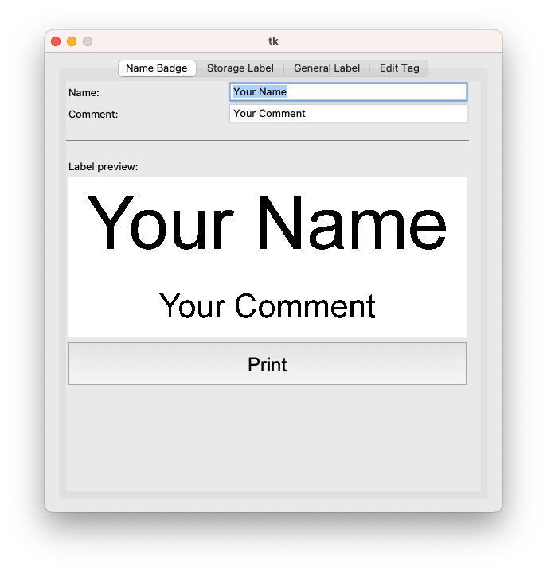
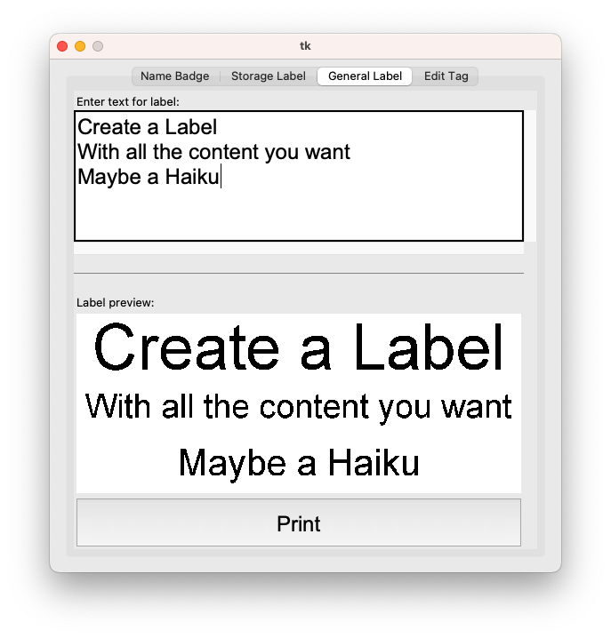
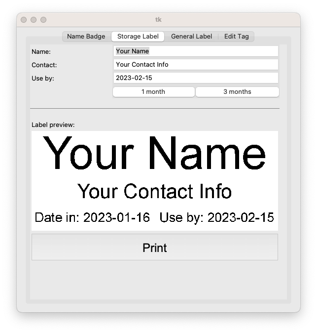

Makespace Badger-NG
===================

This is a re-implementation of the Makespace Badger, originally
https://github.com/Makespace/Badger

This is used at [Makespace](https://makespace.org) for members to print
labels for different purposes.

## Badge Types

### Name badges



A member can scan their door access fob, and a name-badge will be printed based
on information stored in a sqlite database.

If the tag does not exist in the database, the user will be prompted to add
their information.

### General Labels



Labels can be printed with free-form text. Here, Badger-NG improves over the
original by allowing an arbitrary number of lines of arbitrary length. It will
attempt to adjust the font-size of each line to make it fit (this logic is not
very smart).

### Storage Labels



This is an enhancement on top of the original Badger, allowing labels to be
printed which include dates, suitable for labelling things in a way which
meets the Makespace storage requirements

## Operation

Just scanning a fob will default to printing a name badge (if the fob is
enrolled), the same as the original Badger. If the fob is not enrolled,
the UI will allow the user to enter their information. The UI will also populate
and switch to the "Name Badge" tab.

Holding down the left-hand button while scanning a fob will open the "Edit Tag"
screen, allowing a user to update the information associated with their fob.
This is functionally the same as the original Badger.

Holding down the right-hand button while scanning a fob will open the
"Storage Label" screen, populating it with the user's data from the database,
and a "use-by date" of 30 days in the future. The user can adjust the date
as necessary and print the label.

Scanning the "General" tag attached to the desk will open the "General Label"
screen, where a user can enter any text they want and print a label.

The three label types can also be accessed manually (without a fob) via the UI.
The "Edit Tag" screen can only be accessed by first scanning a fob, to prevent
inadvertent modification of other members' data.

## Reasons for re-implementation

The original Badger code was written in Python 2, which became end-of-life
on January 1st 2020. Badger-NG uses Python 3

The original Badger code was hard to extend (which was what I was originally
trying to do), as it intermixed the UI, database and label generation code, and
also had multiple top-level scripts.

Badger-NG is designed to be more modular, so that we can easily change different
aspects - for example how labels are rendered, how the database is accessed,
how fobs are scanned. This would allow us to use the main members' database as
the source of information in the future.

The original Badger code used a `cups` driver for the printer, meaning that
`cups` and the specific driver module needed to be installed. Badger-NG has its
own Python 3 implementation of a driver for the printer. Its only dependency
for the printer is the `pyusb` library.

## Limitations and known issues

Badger-NG doesn't make any attempt to interact with the system screensaver
(yet) - so it can't wake the screen when a user scans a fob.

The original Badger system blanked the screen after periods of inactivity, and
woke it again at appropriate times - but it seems to leave the backlight on,
so presumably doesn't actually result in any power savings. Badger-NG should
improve on that if/when support is added.

## Installation

TODO - but once all functionality is frozen, it should be a case of:

`pip3 install -r requirements.txt`

It depends on:
* PIL (Pillow)
* pyserial
* pyusb
* tkinter (part of standard Python 3 installation)

Ideally, it would be installed in a virtualenv:

```
python3 -m virtualenv badger_venv
. ./badger_venv/bin/activate
pip3 install -r requirements.txt
python3 main.py ui --printer d450 --database badger.db
```

## TODO List

* The 10mm margin should be implemented more cleanly. At the moment, the label
  size is just reduced by 10mm before instantiating Label()
  It would be better to pass a margin down to the Label() class and have it
  handle it.
* Implement some audio feedback. This is hacked in on the Makespace machine, but
  needs to be done properly. The laptop's sound card seems to enter some sleep
  mode after inactivity, so I think the implementation needs to be a thread
  (outside of tkinter) which periodically plays a "silent" sound clip to keep
  the sound card alive, playing beeps when requested.
* Performance improvements:
** The preview shouldn't update on every keystroke. There should be a timer so
   that it updates after some short period of time (bonus points for doing the
   image render in a different thread from the UI)
** Implement a font cache. I haven't measured it, but I expect that loading all
   the font sizes is a significant overhead in rendering
** Implement a smarter font-size search (binary search?)
* Font selection?!
